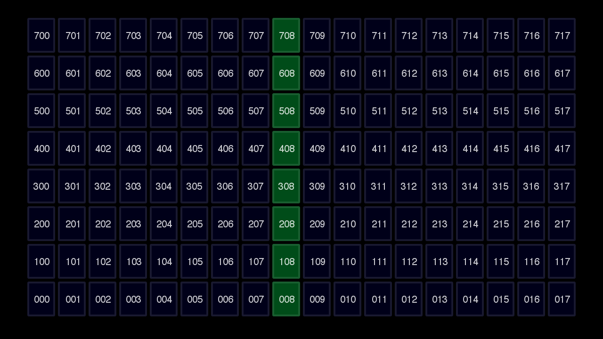

ccpu - C/C++ for GA144
======================

This package is an alternate toolchain for GA144 CPUs. The tools are all Python-based,
and the only additional requirement is PySerial.

For example, [fibonacci.ga](src/fibonacci.ga) counts in the Fibonacci sequence in node 608, and transmits the integers back to the PC via the serial port on node 708.

It writes the integer sequence on the serial port:

    2
    3
    5
    8
    13
    21
    etc.
  
Another example, 
[mathdemo.ga](src/mathdemo.ga) counts up from 100, on node 008.

To use it, connect the USB cable to USB port A on your GA144 board, and (assuming your device is at /dev/ttyUSB0) do:

    python asm.py /dev/ttyUSB0 fibonacci.ga

You should see something like this:

    ...
    bootstream is 906 words
    ---------  DOWNLOAD COMPLETE  ----------
    0x00002  2
    0x00003  3
    0x00005  5
    0x00008  8
    0x0000d  13
    0x00015  21
    
Instruction set notes:

  http://www.colorforth.com/inst.htm

  http://www.colorforth.com/arith.htm

  http://www.intellasys.net/phpBB/viewforum.php?f=8

  http://www.colorforth.com/etherCode.htm

Booting:

  http://www.forth.org/svfig/kk/11-2013-Shattuck.pdf

Eagle library

  http://esaid.free.fr/tutoriel_arrayforth/Ga144_pcb/Ga144/GA144_SRAM_IS2/GA144/

Datasheets:

  http://www.cypress.com/?docID=45536

1.8V DC-DC: http://www.diodes.com/datasheets/AP6015.pdf

128Kx16 SRAM: CY62137FV18LL
256Kx16 SRAM: CY62147EV18

CCPU for GA144

The gcc target is an 8-register 32-bit CPU "CCPU" with 16 bit instructions.
CCPU is a Von Neumann architecture with program and data in SRAM.
Target execution rate is limited by the 55ns SRAM to 18 MIPS.

CCPU is in nodes 007, 008, 009. The nodes have ~10 cycles to execute the instruction.
Instructions, fetched from SRAM, arrive on 007's parallel bus.
007 interprets the instruction.
The 8 registers use 16 cells in 007's RAM.

How many multiplications per second?
  144 * 666e6 / 36 = 2.6 billion
  650 * 480 = 282 multiplications/pixel

label     slot0   slot1   slot2   slot3
x!        @p      drop    !p      ;
x         @p      ;
                       100

\ double convention is for the lsw to be on top

Board:
  1.8V vccio
Mandelbrot:
  480 x 272 x 30 = 255ns per sample, 3.9 MHz
  Each multiply is 72ns, 256 multiplies, 18432ns
  So need 72 nodes

00000 Completion (jump) Address
00000 Transfer (store) Address
00007 Transfer Size in words
      Data words
